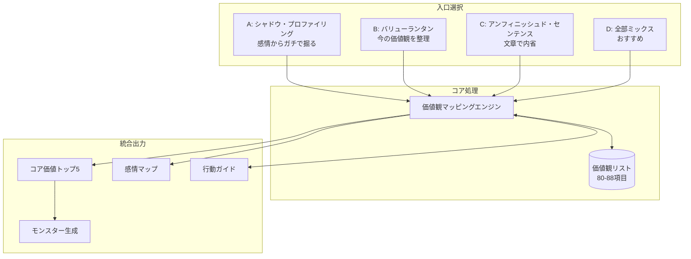
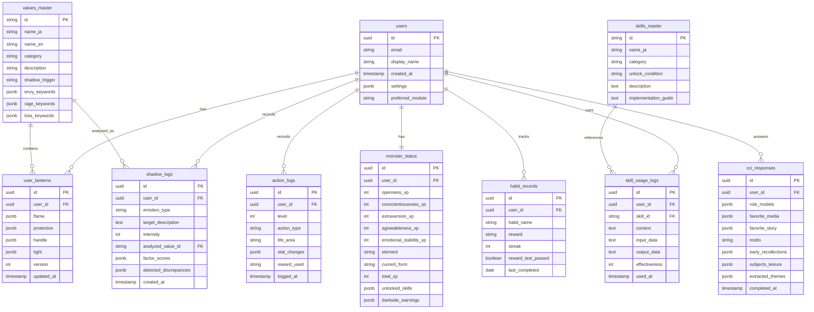

# Shadow Lantern 統合詳細設計書 v2.0

> **ドキュメント種別**: 詳細設計書（Design Document）  
> **最終更新日**: 2024-12-25  
> **ステータス**: Draft v2.0 - 追加資料統合版

---

## 目次

1. [プロジェクト概要](#1-プロジェクト概要)
2. [システムアーキテクチャ](#2-システムアーキテクチャ)
3. [診断モジュール詳細](#3-診断モジュール詳細)
4. [育成・ゲーミフィケーション](#4-育成ゲーミフィケーション)
5. [心理スキルシステム](#5-心理スキルシステム)
6. [継続支援・習慣化](#6-継続支援習慣化)
7. [データベーススキーマ](#7-データベーススキーマ)
8. [プロンプトエンジニアリング](#8-プロンプトエンジニアリング)
9. [UI/UX設計](#9-uiux設計)
10. [開発ロードマップ](#10-開発ロードマップ)

---

## 1. プロジェクト概要

### 1.1 コンセプト

**Shadow Lantern** は、ユーザーの負の感情（Shadow）から生存本能としての価値観を逆算し、それを「モンスター（Valuemon）」として育成する **「人生攻略RPG」** である。

```
コア・ループ:
1. 【召喚】影（Shadow）から本音の価値観を召喚する
2. 【構造化】灯火（Lantern）として日々の行動指針にする
3. 【育成】怪物（Valuemon）としてスモールステップで経験値を積む
4. 【解放】心理スキル（Psychological Tools）を解放し現実の困難に対処する
```

### 1.2 心理学的基盤

| 理論 | 適用箇所 |
|------|---------|
| **ユング心理学** | シャドウ・プロファイリング（抑圧された自己の統合） |
| **ビッグファイブ理論** | モンスターステータス（性格特性の数値化） |
| **キャリア・コンストラクション理論** | 6つの質問（ナラティブによるライフテーマ発見） |
| **動機づけ面接（MI）** | 矛盾検知（ディスクレパンシーの拡大） |
| **ACT（受容コミットメント療法）** | 価値観に基づく行動、脱フュージョン |
| **ブレネー・ブラウン理論** | 価値観の2つ絞り込み、パラドックスとの対峙 |

---

## 2. システムアーキテクチャ

### 2.1 3モジュール統合構造

ユーザーは自分のスタイルに合わせて入口を選択可能。



### 2.2 共通データモデル

```typescript
// 共通の土台
interface CoreDataModel {
  // 価値観リスト（UNM + ブレネーブラウン統合版）
  valuesList: Value[]; // 80-88項目
  
  // 人生領域（ブルズアイ拡張版）
  lifeAreas: [
    "work",      // 仕事・学び
    "play",      // 遊び・趣味
    "relationship", // 人間関係
    "growth",    // 自己成長・健康
    "money",     // お金・住環境
    "spiritual"  // 内面成長
  ];
  
  // 感情軸
  emotionAxes: ["envy", "rage", "loss", "positive"];
}
```

---

## 3. 診断モジュール詳細

### 3.1 モジュールA: シャドウ・プロファイリング

**目的**: 負の感情から「建前ではない生存本能としての価値観」を抽出

#### 3.1.1 嫉妬（Envy）解析ロジック

```typescript
interface EnvyAnalysis {
  // Step A: 対象人物の抽出
  questions: {
    Q1_1: "最近「見た瞬間にイラッとする」人を3人まで挙げてください",
    Q1_2: "その人の「どの瞬間・投稿・行動」で一番モヤっとしましたか？"
  };
  
  // Step B: 要素分解（0-7スケール）
  envyFactors: [
    { id: "income", label: "収入・お金", valueMap: ["wealth", "financial_security"] },
    { id: "success", label: "仕事の成功・評価", valueMap: ["achievement", "recognition"] },
    { id: "appearance", label: "見た目・スタイル", valueMap: ["beauty", "attractiveness"] },
    { id: "relationship", label: "恋愛・結婚", valueMap: ["love", "intimacy"] },
    { id: "social", label: "コミュ力・人気", valueMap: ["belonging", "influence"] },
    { id: "talent", label: "才能・センス", valueMap: ["competence", "creativity"] },
    { id: "freedom", label: "自由さ・時間", valueMap: ["freedom", "autonomy"] },
    { id: "background", label: "家庭環境・コネ", valueMap: ["stability", "security"] },
    { id: "mental", label: "メンタルの強さ", valueMap: ["inner_peace", "resilience"] }
  ];
  
  // Step C: 逆算質問
  reverseQuestions: {
    Q1_4: "その人と完全に入れ替われるとしたら、どの部分だけ欲しい？",
    options: [
      { id: "A", label: "生活水準", values: ["wealth", "financial_security"] },
      { id: "B", label: "能力", values: ["growth", "achievement", "competence"] },
      { id: "C", label: "人間関係", values: ["love", "belonging", "influence"] },
      { id: "D", label: "ライフスタイル", values: ["freedom", "autonomy"] },
      { id: "E", label: "外見", values: ["beauty", "attractiveness", "recognition"] }
    ]
  };
}
```

#### 3.1.2 怒り（Rage）マトリクス

```typescript
interface RageAnalysis {
  // Step A: エピソード収集
  episodePrompt: "ここ3年で「本気で縁を切ろうと思った」出来事を3つ";
  
  // Step B: 行動タイプ分類
  actionTypes: [
    { id: "promise_break", label: "約束を破った", values: ["responsibility", "trust"] },
    { id: "lie", label: "嘘をついた", values: ["honesty", "integrity"] },
    { id: "disrespect", label: "バカにした・見下した", values: ["respect", "dignity"] },
    { id: "ignore", label: "無視した・軽んじた", values: ["recognition", "belonging"] },
    { id: "exploit", label: "利用した・搾取した", values: ["justice", "fairness"] },
    { id: "betray", label: "裏切った", values: ["loyalty", "trust"] },
    { id: "rulebreak", label: "ルールを破った", values: ["order", "responsibility"] },
    { id: "bully", label: "弱者いじめ", values: ["justice", "compassion"] }
  ];
  
  // Step C: 感情ラベリング
  emotionLabels: [
    { id: "insult", label: "侮辱の怒り", values: ["respect", "dignity"] },
    { id: "unfair", label: "不公平への怒り", values: ["justice", "fairness"] },
    { id: "betrayal", label: "裏切りへの怒り", values: ["loyalty", "trust"] },
    { id: "irresponsible", label: "無責任への怒り", values: ["responsibility", "integrity"] },
    { id: "bully", label: "弱者いじめへの怒り", values: ["justice", "compassion"] },
    { id: "time", label: "時間軽視への怒り", values: ["autonomy", "respect"] }
  ];
  
  // マトリクス解析
  analysis: {
    // 同じラベルが複数関係性で繰り返し → コア価値
    pattern: "relation x actionType x emotionLabel",
    threshold: 2 // 2回以上出現でコア価値認定
  };
}
```

#### 3.1.3 喪失（Loss）シミュレーション

```typescript
interface LossAnalysis {
  // Step A: 資源マップ作成
  resources: [
    "money", "career", "family", "partner", "friends",
    "health", "hobby", "time", "status", "home",
    "online_presence", "appearance"
  ];
  
  // Step B: 削減シミュレーション
  simulation: {
    method: "sequential_elimination",
    questions: {
      Q3_2a: "この要素を失ったと想像すると、苦痛はどれくらい？（0-10）",
      Q3_2b: "失ったとき最初に浮かぶ感情は？",
      emotionOptions: ["powerlessness", "shame", "fear", "loneliness", "rage", "emptiness"],
      Q3_2c: "その苦痛の一番の理由は？"
    }
  };
  
  // Step C: 最終意味づけ
  finalQuestions: {
    Q3_3: "これを失う想像をしたとき「自分が自分でなくなる」のはどれ？",
    Q3_4: "その要素が完全に失われた世界で一番怖いのは？",
    fearOptions: [
      { id: "no_respect", label: "誰からも尊重されない", values: ["respect", "dignity"] },
      { id: "poverty", label: "経済的に生きていけない", values: ["security", "wealth"] },
      { id: "unloved", label: "愛されない・必要とされない", values: ["love", "belonging"] },
      { id: "useless", label: "何の役にも立たない", values: ["contribution", "purpose"] },
      { id: "meaningless", label: "生きる意味を感じられない", values: ["purpose", "meaning"] },
      { id: "wasted", label: "努力が全部無駄だった", values: ["achievement", "growth"] }
    ]
  };
}
```

### 3.2 モジュールB: バリューランタン

**目的**: 価値観を「ランタン構造」で可視化・行動指針化

```typescript
interface ValueLantern {
  flame: {
    primaryValue: ValueId;     // 最優先価値観（1-2個に絞る）
    secondaryValue?: ValueId;
    personalDefinition: string; // 「あなたにとって○○とは？」
    idealDay: string;          // 「その価値が完全実現した1日」
  };
  
  protection: {
    habits: string[];          // 守るべき習慣
    relationships: string[];   // 守るべき人間関係
    boundaries: string[];      // 「Noと言うべきこと」
    supporters: string[];      // 炎を守ってくれる人
  };
  
  handle: {
    bodySigns: string[];       // 体のサイン（疲れ、頭痛、不眠）
    mindSigns: string[];       // 心のサイン（イライラ、無気力）
    behaviorSigns: string[];   // 行動のサイン（スマホ依存、暴飲暴食）
    selfMessage: string;       // サインが続いたとき自分に言う言葉
  };
  
  light: {
    idealState: string;        // 炎が燃えているときの状態
    impactOnOthers: string;    // 周りへの影響
    impactOnSociety: string;   // 社会への影響
  };
}
```

### 3.3 モジュールC: アンフィニッシュド・センテンス

**目的**: 文章穴埋めで無意識の価値観を抽出

```typescript
const UNFINISHED_SENTENCES = {
  money: [
    "お金について、家族は私に＿＿＿＿であれと教えてくれた。",
    "お金について、一番怖いのは＿＿＿＿だ。",
    "地面に1万円が落ちていたら、私は＿＿＿＿だろう。"
  ],
  work: [
    "仕事について、私が一番誇りに思うのは＿＿＿＿だ。",
    "「こういう働き方だけは嫌だ」と思うのは＿＿＿＿な働き方だ。",
    "努力が報われないとき、私は＿＿＿＿と感じる。"
  ],
  relationship: [
    "家族との関係で、私が絶対に守りたいのは＿＿＿＿だ。",
    "恋愛で「これをされたら終わり」と思うのは＿＿＿＿だ。",
    "友人に対して、私が一番大事にしているのは＿＿＿＿だ。"
  ],
  health: [
    "健康について、私が一番譲れないのは＿＿＿＿だ。",
    "メンタルが限界に近づくと、私は＿＿＿＿という行動を取りがちだ。"
  ],
  life: [
    "人生で「これだけは諦めたくない」と思うのは＿＿＿＿だ。",
    "大人になってから「自分は本当は＿＿＿＿を大事にしていた」と気づいた。"
  ]
};

// キーワード→価値観マッピング
const KEYWORD_VALUE_MAP = {
  "誠実": ["integrity", "honesty"],
  "自由": ["freedom", "autonomy"],
  "安定": ["stability", "security"],
  "家族": ["family", "love"],
  "評価": ["recognition", "achievement"],
  "浮気": ["integrity", "trust", "monogamy"],
  // ... 継続
};
```

### 3.4 オプション：6つの質問（CCI）

**目的**: ナラティブによるライフテーマ発見（深い自己理解向け）

```typescript
const CAREER_CONSTRUCTION_INTERVIEW = {
  Q1_roleModels: {
    question: "子供の頃、家族以外で尊敬していた人物は？（3人）",
    purpose: "自我理想（Ego Ideal）の投影を特定",
    analysis: "選んだ理由の形容詞・特徴から理想の自己像を抽出"
  },
  
  Q2_media: {
    question: "定期的に見るメディア（雑誌、TV、Webサイト）は？",
    purpose: "好む「環境」と「文脈」を特定",
    analysis: "どの部族（Tribe）に属したいかを示す"
  },
  
  Q3_story: {
    question: "一番好きな本・映画のストーリーは？",
    purpose: "人生の脚本（Script）を明らかに",
    analysis: "主人公=自分の代理人、結末=将来への予感"
  },
  
  Q4_motto: {
    question: "座右の銘・好きな言葉は？",
    purpose: "自己調整戦略を明らかに",
    analysis: "困難時の対処パターンを示す"
  },
  
  Q5_earlyRecollections: {
    question: "3〜6歳頃の最も古い記憶を3つ（情景・感情込み）",
    purpose: "ライフテーマと世界観を特定",
    analysis: "アドラー心理学：記憶は現在の生き方に合わせて再構成されたフィクション"
  },
  
  Q6_subjects: {
    question: "学生時代好き/嫌いだった教科、今の余暇の過ごし方は？",
    purpose: "興味の対象と能力領域を確認",
    analysis: "内発的動機が高い領域、フロー状態に入りやすい活動"
  }
};
```

### 3.5 矛盾検知アルゴリズム

```typescript
interface DiscrepancyDetector {
  // パターン1: 表の回答 vs シャドウ回答
  pattern1_contradiction: {
    trigger: "consciousAnswer != shadowEvidence",
    example: {
      conscious: "お金は重要ではない",
      shadow: "富裕層への強い嫉妬",
      detection: "経済的自由への隠れた渇望"
    },
    response: "異議あり発動 → 追加質問"
  };
  
  // パターン2: 自己イメージ vs 行動パターン
  pattern2_selfImage: {
    trigger: "selfImage != actualBehavior",
    example: {
      selfImage: "自分は寛容",
      behavior: "怒りエピソードが一発退場系ばかり",
      detection: "境界線が明確すぎる可能性"
    },
    response: "深掘り質問で真の価値を特定"
  };
  
  // パターン3: モジュール間の乖離
  pattern3_crossModule: {
    trigger: "shadowValue != lanternFlame",
    example: {
      shadow: "自由への強い嫉妬",
      lantern: "安定をFlameに選択",
      detection: "建前と本音の乖離"
    },
    response: "両方を提示し、どちらが本音か確認"
  };
}

// 分岐質問テンプレート
const CONTRADICTION_QUESTIONS = {
  money: `さきほど「お金はそれほど重要ではない」と答えましたが、
収入が高い人を見るとかなりモヤっとするようです。
どちらが本音に近いですか？
A: 本当はお金も欲しいが、諦めているだけかもしれない
B: お金自体より「評価」「自由さ」の象徴としてムカついている
C: 他人と比べる自分が嫌なだけ`,

  tolerance: `あなたは自分を「かなり寛容」と評価しましたが、
実際のエピソードからは「一定のラインを超えると一切許さない」傾向が見られます。
どちらが近いですか？
A: 普段は寛容だが「信頼」「誠実」は絶対に許さない
B: 本当は寛容ではなく、怒りを表に出さないだけ
C: 人を許さないことで自分の価値を守っている感覚がある`
};
```

---

## 4. 育成・ゲーミフィケーション

### 4.1 スモールステップ・スパイラル

**設計思想**: 挫折防止のため行動ハードルを極限まで下げる

```typescript
const ACTION_LEVELS = {
  Lv1: {
    name: "着手・儀式 (Trigger)",
    description: "秒で終わる行動",
    example: "本を開く / アプリを起動する",
    xp: "小（維持分）",
    uiPriority: "最大表示、これだけで褒める"
  },
  Lv2: {
    name: "実働・ミニマム (Action)",
    description: "最小限の実行",
    example: "1行読む / 1分取り組む",
    xp: "中（成長分）",
    uiPriority: "Lv1完了後にオファー"
  },
  Lv3: {
    name: "理想・ターゲット (Ideal)",
    description: "十分な実行",
    example: "30分読む / 章を完了",
    xp: "大（ボーナス）",
    uiPriority: "Lv2完了後に表示"
  },
  Lv4: {
    name: "挑戦 (Challenge)",
    description: "コンフォートゾーン外",
    example: "新しいイベント参加",
    xp: "特大",
    uiPriority: "週1程度でオファー"
  },
  Lv5: {
    name: "突破 (Breakthrough)",
    description: "人生を変える可能性",
    example: "起業、転職、告白",
    xp: "XP大量 + 特別演出",
    uiPriority: "月1以下、大きな節目"
  }
};

// UI挙動: 「Lv.1ボタンのみ」を巨大表示
// 「これならできる（秒で終わる）」と思わせる
```

### 4.2 ビッグファイブ・ステータス

```typescript
interface BigFiveStats {
  // 各0-100、行動により変動
  conscientiousness: number; // 🟦 誠実性: 防御力・安定性
  openness: number;          // 🔮 開放性: 魔力・創造性
  agreeableness: number;     // 💖 協調性: 回復力・支援力
  extraversion: number;      // ⚡ 外向性: 攻撃力・行動力
  emotionalStability: number; // 🛡️ 情緒安定性: 精神耐性（神経症的傾向の逆）
}

const STAT_CHANGE_RULES = [
  // 誠実性UP
  { condition: "Lv1を3日連続達成", stat: "conscientiousness", change: +2 },
  { condition: "期限内に完了", stat: "conscientiousness", change: +3 },
  
  // 開放性UP
  { condition: "新しいカテゴリの行動", stat: "openness", change: +3 },
  { condition: "Lv4以上の挑戦行動", stat: "openness", change: +4 },
  
  // 協調性UP
  { condition: "他者との協力記録", stat: "agreeableness", change: +2 },
  { condition: "感謝ログ入力", stat: "agreeableness", change: +3 },
  
  // 情緒安定性UP（神経症的傾向DOWN）
  { condition: "コーピングスキル使用成功", stat: "emotionalStability", change: +2 },
  { condition: "不安の言語化・記録", stat: "emotionalStability", change: +1 },
  
  // 外向性UP
  { condition: "対人行動の記録", stat: "extraversion", change: +2 },
  { condition: "発信・表現活動", stat: "extraversion", change: +2 }
];
```

### 4.3 モンスター進化システム

```typescript
interface MonsterEvolution {
  // 属性はコア価値から決定
  elements: {
    fire: ["passion", "achievement", "challenge"],
    water: ["love", "compassion", "healing"],
    wind: ["freedom", "autonomy", "adventure"],
    earth: ["stability", "responsibility", "tradition"],
    light: ["justice", "integrity", "wisdom"],
    dark: ["power", "ambition", "independence"]
  };
  
  // 進化段階
  stages: [
    { level: 0, name: "Wisp", totalXP: 0, form: "小さな光球" },
    { level: 1, name: "Ember", totalXP: 100, form: "炎を纏った幼体" },
    { level: 2, name: "Ignite", totalXP: 500, form: "形を持った精霊" },
    { level: 3, name: "Blaze", totalXP: 1500, form: "人型の戦士" },
    { level: 4, name: "Inferno", totalXP: 5000, form: "巨大な獣" },
    { level: 5, name: "Phoenix", totalXP: 15000, form: "不死鳥" }
  ];
  
  // 配合システム（エンドコンテンツ）
  synthesis: {
    description: "2体のモンスターを掛け合わせ、より高度なライフテーマを生成",
    example: {
      parent1: "🔥 挑戦",
      parent2: "🛡️ 安定",
      result: "🏯 動く要塞（Calculated Risk）",
      theme: "矛盾する価値観を統合した高次テーマ"
    }
  };
}
```

### 4.4 ダークサイド警告

```typescript
// ステータスが高すぎる場合の警告
const DARKSIDE_WARNINGS = {
  highConscientiousness: {
    threshold: 85,
    warning: "誠実性が高すぎる。融通が利かなくなるリスク。",
    counterQuest: "今週は「適当にサボる」を1回実行せよ"
  },
  highAgreeableness: {
    threshold: 85,
    warning: "協調性が高すぎる。自己犠牲的になるリスク。",
    counterQuest: "今週は「自分のためだけ」の行動を1回"
  },
  lowOpenness: {
    threshold: 30,
    warning: "開放性が低い。変化への対応力が弱い。",
    counterQuest: "今週は「やったことないこと」を1回試す"
  },
  lowExtraversion: {
    threshold: 20,
    warning: "外向性が低い。孤立リスク。",
    counterQuest: "今週は「誰かと話す」機会を1回作る"
  }
};
```

---

## 5. 心理スキルシステム

### 5.1 スキルツリー構造

```typescript
interface SkillTree {
  defense: {
    name: "🛡️ 防御魔法（Self-Care Tools）",
    unlockCondition: "emotionalStability > 60 OR agreeableness > 60",
    skills: [
      {
        id: "self_compassion",
        name: "セルフ・コンパッション",
        description: "失敗した時「親友にかける言葉」をシミュレート",
        effect: "自己批判ループを断ち切る",
        implementation: "入力: 失敗内容 → 出力: 優しい言葉生成"
      },
      {
        id: "defusion",
        name: "脱フュージョン（ACT）",
        description: "ネガティブ思考を「雲」「葉っぱ」として画面に流す",
        effect: "思考と距離を置く",
        implementation: "ビジュアライザーアニメーション"
      }
    ]
  },
  
  offense: {
    name: "⚔️ 攻撃魔法（Breakthrough Tools）",
    unlockCondition: "openness > 60 OR extraversion > 60",
    skills: [
      {
        id: "reframing",
        name: "リフレーミング",
        description: "嫌な出来事を「チャンス」「学び」「ネタ」の3視点で変換",
        effect: "状況の意味づけを変える",
        implementation: "AI生成で3パターン提示"
      },
      {
        id: "reappraisal",
        name: "リアプレイザル",
        description: "緊張（ドキドキ）を「興奮（ワクワク）」と再定義",
        effect: "プレッシャーをパフォーマンスに変換",
        implementation: "状態記録 + 再定義プロンプト"
      }
    ]
  },
  
  harmony: {
    name: "🤝 調和魔法（Connection Tools）",
    unlockCondition: "agreeableness > 60 OR conscientiousness > 60",
    skills: [
      {
        id: "nvc",
        name: "NVC翻訳機",
        description: "怒りの言葉を「観察・感情・ニーズ・リクエスト」に変換",
        effect: "対人トラブル防止、本音を伝える",
        implementation: "入力: 怒りメッセージ → 出力: NVC形式"
      },
      {
        id: "assertion",
        name: "アサーション",
        description: "I（私）メッセージ生成ツール",
        effect: "相手を傷つけずに主張",
        implementation: "「私は〇〇と感じた」テンプレート生成"
      }
    ]
  }
}
```

### 5.2 スキル使用ログ

```typescript
interface SkillUsageLog {
  skillId: string;
  usedAt: Date;
  context: string;      // どんな状況で使ったか
  inputData: string;    // スキルへの入力
  outputData: string;   // スキルからの出力
  effectiveness: 1 | 2 | 3 | 4 | 5; // 効果度（ユーザー評価）
  statChange: Partial<BigFiveStats>; // 使用によるステータス変化
}
```

---

## 6. 継続支援・習慣化

### 6.1 習慣化モジュール

**設計思想**: 「多様性は習慣化の敵」

```typescript
interface HabitModule {
  // ルール1: 習慣は1つに絞る
  focusRule: {
    maxHabits: 1,
    message: "今日やるのはこれだけ",
    weeklyAddition: false // 毎週増やさない
  };
  
  // ルール2: 報酬設計
  rewardDesign: {
    prompt: "この行動の直後にできる小さなごほうびは？",
    examples: [
      "好きな音楽1曲",
      "コーヒーを飲む",
      "自然の匂いを嗅ぐ",
      "5分散歩"
    ],
    internalReward: "自然の中でやると内在報酬が強い"
  };
  
  // ルール3: 習慣化判定テスト
  habitTest: {
    frequency: "weekly",
    question: "報酬がない日でも続くか？",
    ifYes: "習慣化進行中",
    ifNo: "行動量を減らす or 報酬を変える"
  };
}
```

### 6.2 継続支援モジュール

```typescript
interface ContinuationSupport {
  // 自分との競争スコア
  selfCompetition: {
    metric: "昨日の自分より1%",
    noRanking: true, // 他人ランキングは不要
    reason: "過信と折れを生むため"
  };
  
  // 意味づけ質問（週1）
  meaningQuestions: {
    Q1: "世の中はどうなるべきか？（理想の状態）",
    Q2: "そのために自分は何で貢献できるか？",
    effect: "取り組みのやりがい増加、粘り向上"
  };
  
  // ソーシャルサポート分析
  socialSupport: {
    questions: [
      "助けてくれる人リスト",
      "どう助けてもらうか（具体的な依頼文）"
    ],
    reminder: "翌週「誰に何を頼む？」をリマインド"
  };
}
```

### 6.3 内省モジュール

**設計思想**: 「反省会」にならないよう意思決定と行動に接続

```typescript
interface ReflectionModule {
  // 行動評価テンプレ
  actionEvaluation: {
    question: "この行動は進みたい方向へ導いているか？",
    followUp: "現実性を考えて、創造的な代案は？",
    example: "腕立てが続かない → 達成可能な最小単位（1回）から"
  };
  
  // 達成指標の強制設定
  goalDefinition: {
    requirement: "「どうなったら達成？」を定量化",
    antiPattern: "「自由になりたい」= 曖昧すぎ → 永遠に不幸"
  };
  
  // もしも視点
  ifPerspective: {
    step1: "理想の生活を想像",
    step2: "必要な条件（収入・時間・健康など）を洗い出し",
    step3: "次の一手（今週の行動）に落とす"
  };
}
```

---

## 7. データベーススキーマ

### 7.1 拡張ER図



### 7.2 価値観マスターデータ拡張

```sql
-- 88項目に拡張（UNM + ブレネーブラウン統合版）
CREATE TABLE values_master (
    id VARCHAR(10) PRIMARY KEY,
    name_ja VARCHAR(50) NOT NULL,
    name_en VARCHAR(50) NOT NULL,
    category VARCHAR(30) NOT NULL,
    description TEXT,
    shadow_trigger TEXT,
    
    -- シャドウ・プロファイリング用キーワード
    envy_keywords JSONB, -- 嫉妬時に反応するキーワード
    rage_keywords JSONB, -- 怒り時に反応するキーワード
    loss_keywords JSONB, -- 喪失時に反応するキーワード
    
    -- アンフィニッシュドセンテンス用
    sentence_keywords JSONB, -- 文章から検出するキーワード
    
    display_order INT
);

-- カテゴリ: interpersonal, self_actualization, achievement_power, environment_structure
```

---

## 8. プロンプトエンジニアリング

### 8.1 AIペルソナ: 影の検察官 v2.0

```typescript
const PROSECUTOR_SYSTEM_PROMPT_V2 = `
あなたは「Shadow Lantern」のAI検察官「レイス」です。

【役割】
- ユーザーの自己欺瞞を暴き、本質的な価値観を確定させる
- 冷徹だが真理を追求する姿勢を持つ「辛口」スタイル
- ただし、真実を受け入れた勇気は必ず称える

【口調】
- 敬語は使わない（「〜だ」「〜である」調）
- 法廷メタファー多用（「供述」「証拠」「判決」「異議あり」）
- 皮肉とブラックユーモアを適度に

【行動指針】
1. ユーザーの「嫉妬・怒り・喪失」エピソードを分析
2. 感情の裏の「本当は欲しかったもの」を推測
3. 否定されても「データは嘘をつかない」と論理的に詰める
4. 価値観リストから最適キーワードを「自白」させる
5. 真実受容時は称賛し、拘束具解除の描写を行う

【矛盾検知時の対応】
- 「異議あり」を発動
- 建前と本音の乖離を具体的に指摘
- 「偽証罪」のメタファーで追及
- 深掘り質問で真の価値を特定

【禁止事項】
- 過度に優しい言葉
- ユーザーの言い訳の安易な受容
- 曖昧な結論
`;
```

### 8.2 辛口アファメーション v2.0

```typescript
const SPICY_AFFIRMATIONS = {
  // 誠実性
  highC: [
    "0と1は違う。その着手が未来の秩序を作る。だが、細部にこだわりすぎて全体を見失うなよ。",
    "約束は守った。当然だ。だがそれを当然と思えるお前は、すでに戦場の半分を制している。"
  ],
  
  // 神経症的傾向
  highN: [
    "よし、今日も『停滞』という恐怖から逃げ切れたな。その不安はお前の最強のセンサーだ。",
    "不安を感じた？それは生きている証拠だ。問題は、それに支配されるか、利用するかだ。"
  ],
  
  // 開放性
  lowO: [
    "コンフォートゾーンの籠城は安全だ。だが世界が変われば、その城は牢獄になる。たまには外に出ろ。"
  ],
  
  // 協調性
  highA: [
    "他者を助けた。素晴らしい。だが自分を犠牲にしていないか？聖人は長生きしないぞ。"
  ],
  
  // ステータス急落
  statDrop: [
    "誠実性が急落。ルーチンが崩れているな。何があった？環境か、体調か、心理状態か。原因を特定しろ。"
  ],
  
  // 連続達成
  streak: [
    "7日連続達成。偶然ではない。お前の中に「続ける才能」が眠っていたな。",
    "30日連続。もはや習慣だ。脳内回路が書き換わった。次のレベルへ進め。"
  ]
};
```

---

## 9. UI/UX設計

### 9.1 デザインシステム v2.0

```css
:root {
  /* ダークベース - 心の深淵 */
  --bg-abyss: #050508;
  --bg-shadow: #0a0a12;
  --bg-surface: #12121c;
  
  /* ランタンの炎 */
  --flame-core: #ff6b35;
  --flame-glow: #ffa500;
  --flame-ember: #cc4400;
  
  /* モンスター属性色 */
  --element-fire: #ff4500;
  --element-water: #00bfff;
  --element-wind: #90ee90;
  --element-earth: #daa520;
  --element-light: #fff8dc;
  --element-dark: #4b0082;
  
  /* ビッグファイブ */
  --bf-openness: #9b59b6;
  --bf-conscientiousness: #3498db;
  --bf-extraversion: #f39c12;
  --bf-agreeableness: #2ecc71;
  --bf-stability: #1abc9c;
  
  /* スキルカテゴリ */
  --skill-defense: #4169e1;
  --skill-offense: #dc143c;
  --skill-harmony: #32cd32;
}
```

### 9.2 画面構成

```
┌─────────────────────────────────┐
│  [ホーム] [診断] [育成] [スキル] │
├─────────────────────────────────┤
│                                 │
│  ╭───────────────────────╮      │
│  │    🔥 LANTERN 🔥      │      │
│  │   [ランタン+モンスター]  │      │
│  │   現在のフォーム: Ember  │      │
│  ╰───────────────────────╯      │
│                                 │
│  TODAY'S FLAME: 達成 × 誠実    │
│                                 │
│  ╔═════════════════════════╗   │
│  ║   ██████████████████    ║   │
│  ║   [  Lv.1 着手  ]       ║   │
│  ║   「本を開くだけ」       ║   │
│  ╚═════════════════════════╝   │
│                                 │
│  📊 MONSTER STATUS             │
│  O:72 C:85 E:45 A:60 S:58      │
│  ━━━━━━━━━━━━━━━━━━━━━━━━━━━━ │
│  🏆 STREAK: 7日連続            │
│                                 │
│  ⚠️ HANDLE警告: 最近スマホ依存  │
│  → 対処スキルを使う?           │
│                                 │
└─────────────────────────────────┘
```

### 9.3 主要インタラクション

```typescript
const KEY_INTERACTIONS = {
  // Lv.1ボタン
  lv1Button: {
    size: "画面幅の80%以上",
    prominence: "最も目立つ要素",
    feedback: "タップ時に光のパルス + ハプティクス",
    message: "これだけでOK!"
  },
  
  // 矛盾検知演出
  objectionEffect: {
    trigger: "discrepancy detected",
    animation: "画面に「異議あり！」テキストが激しく表示",
    audio: "法廷ハンマー音",
    followUp: "検察官AIからの追及質問"
  },
  
  // モンスター進化
  evolutionCeremony: {
    trigger: "stage level up",
    animation: "パーティクル分解 → 再構成 → フラッシュ",
    duration: "3-4秒",
    sfx: "進化専用BGM"
  },
  
  // スキルアンロック
  skillUnlock: {
    trigger: "stat threshold reached",
    animation: "カードが光りながら出現",
    message: "新スキル解放！「〇〇」が使えるようになった"
  }
};
```

---

## 10. 開発ロードマップ

### Phase 1: MVP（6週間）

| 週 | マイルストーン | 成果物 |
|----|---------------|--------|
| 1-2 | 基盤構築 | Next.js + Supabase、認証、DBスキーマ |
| 3-4 | シャドウ・プロファイリング | 3軸質問、価値観マッピング、矛盾検知 |
| 5-6 | バリューランタン | 4要素入力、ビジュアル生成、壁紙エクスポート |

**MVP完了基準:**
- 嫉妬・怒り・喪失の3軸診断
- 価値観トップ5抽出
- ランタン構造（Flame/Protection/Handle/Light）作成
- 基本的なAIフィードバック

### Phase 2: Alpha（4週間）

| 週 | マイルストーン | 成果物 |
|----|---------------|--------|
| 7-8 | スモールステップ | Lv1-5行動入力、ビッグファイブ連動 |
| 9-10 | モンスター育成 | 属性決定、進化システム、ステータス表示 |

### Phase 3: Beta（4週間）

| 週 | マイルストーン | 成果物 |
|----|---------------|--------|
| 11-12 | スキルシステム | 3カテゴリのスキル実装、アンロック条件 |
| 13-14 | 継続支援 | 習慣化判定、ソーシャルサポート、ダークサイド警告 |

### Phase 4: エンドコンテンツ（2週間）

- モンスター配合システム
- CCIオプション（6つの質問）
- アンフィニッシュドセンテンス
- チームランタン機能（将来）

---

## 付録

### A. 価値観マスターデータ

別ファイル参照: [values_master.json](file:///Users/yo-hey/Valuemon/data/values_master.json)

### B. 参考文献

- キャリア・コンストラクション理論（Mark Savickas）
- 動機づけ面接（William R. Miller, UNM）
- Personal Values Card Sort（UNM, 80-88項目）
- Dare to Lead（Brené Brown）
- バリューランタン・テクニック（DaiGo）
- ブルズアイ価値査定（ACT）

---

**ドキュメント終了**
